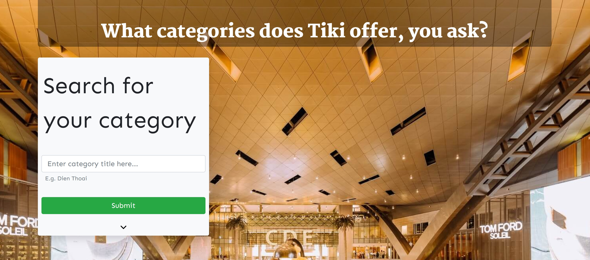
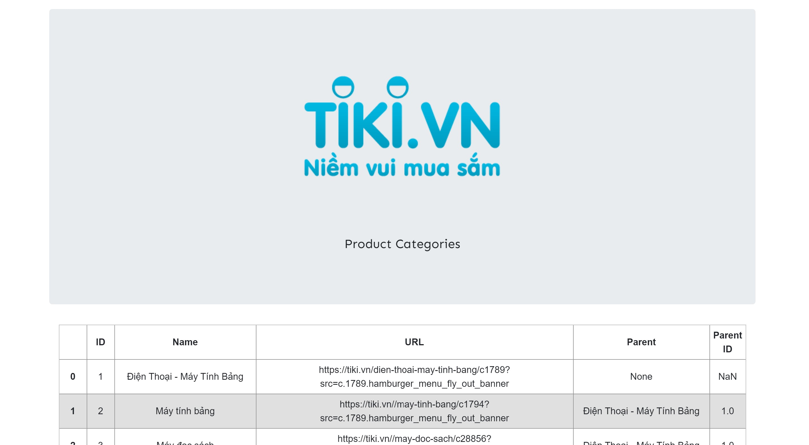

    

## :sunrise_over_mountains: Basic Overview

This is a project to create a website that scrapes the categories of [Tiki.vn](https://www.tiki.vn) and displays them in a quick database overview.  

#### :date: Timeframe for the project
The challenge was to complete the website withing 1 week. (09.03.20-16.03.20)

#### :clapper: Presentation

The complete WebApp can only be viewed when the Flask app is run. Here is a short preview of the site:

    

    

## :boy: Author

**Tobias Becher**
- GitHub [TB-DevAcc](https://github.com/TB-DevAcc/)
- LinkedIn [Tobias Becher](https://www.linkedin.com/in/tobias-becher-b34341197)
- Hackerrank [TB_DevAcc](https://www.hackerrank.com/TB_DevAcc)

## :pray: Acknowledgments

[CoderSchool](https://www.coderschool.vn/en/) for their help, support & mentorship  
Titlephoto from [Tiki.vn](https://www.Tiki.vn)  
Website Main Image by [Naim Benjelloun](https://www.pexels.com/@naimbic) from Pexels  
Icons made by <a href="https://www.flaticon.com/authors/freepik" title="Freepik">Freepik</a> from <a href="https://www.flaticon.com/" title="Flaticon"> www.flaticon.com</a>  

## 📝 License

Copyright © 2020 [Tobias Becher](https://github.com/TB-DevAcc).  
This project is [MIT](https://github.com/kefranabg/readme-md-generator/blob/master/LICENSE) licensed.